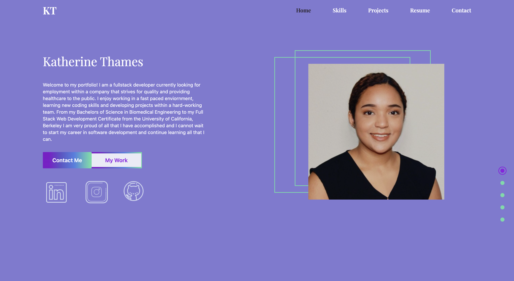

# My Portfolio

[View my portfolio here!](https://lucky-custard-87d730.netlify.app/)

## How It's Made:

**Tech used:** HTML, CSS, JavaScript, React, Tailwind and Vite

I started by creating this project with Vite and then built the functionality and style of the site with React and Tailwind. This was my first time working with all three together and I found them very compatible and easy to use.

## Lessons Learned: 

This is the most CSS heavy project I have worked on so I had a lot to learn. Using icons, images and motion frameworks was what took me the most time to figure out, I wanted to add something interesting to look at for each of the components but I also did not want the site to appear busy. Finding a balance between a site looking clean yet interesting is something I have to continue to learn but I hope this portfolio is a good start. 

## Contact Me: 

Email: k.thames@me.com

 
